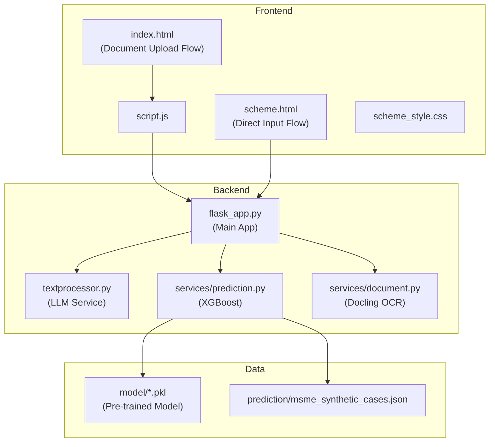
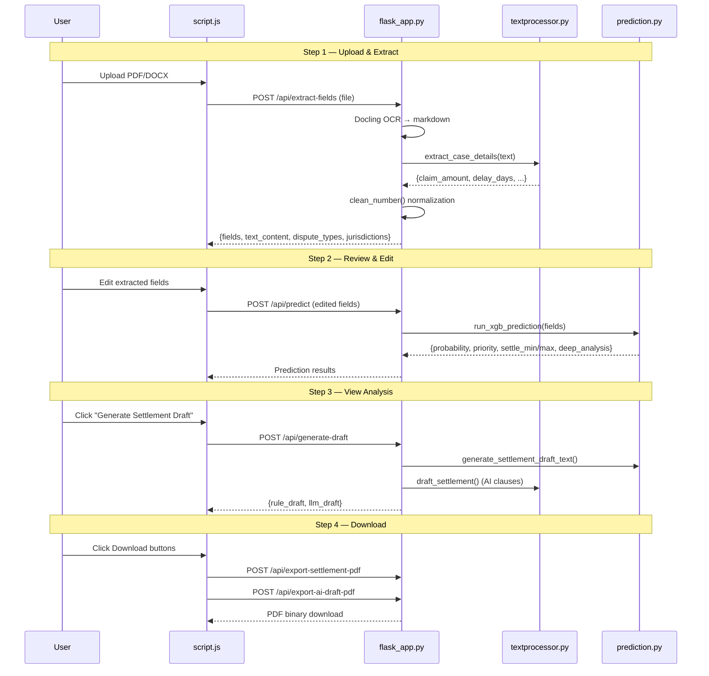
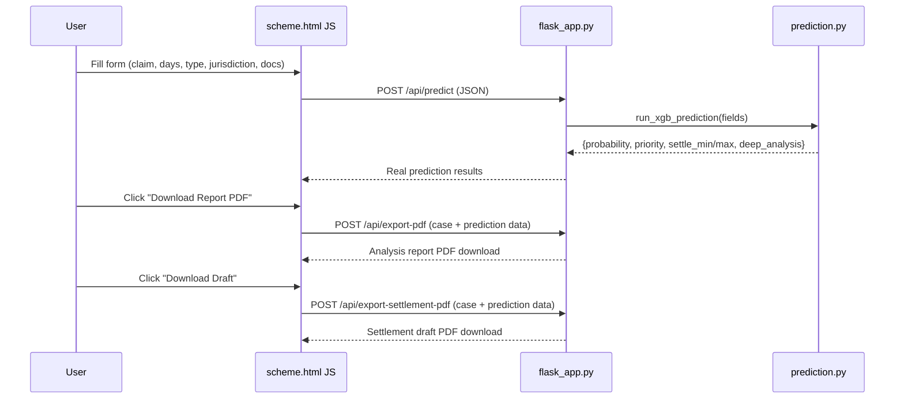

# MSME Negotiation AI — Technical Documentation

## Architecture Overview



---

## User Flows

### Flow 1: Document Upload (Home Page — `index.html`)

This is the **AI-powered flow** with document OCR, field extraction, prediction, and AI-generated drafts.



---

### Flow 2: Direct Input (Scheme Page — `scheme.html`)

This is the **manual entry flow** — no document upload, no AI clauses. User types values, gets prediction + PDFs.



---

## API Endpoints

| Method | Endpoint | Purpose | Used By |
|--------|----------|---------|---------|
| `GET` | `/` | Render `index.html` (doc upload wizard) | Browser |
| `GET` | `/schema` | Render `scheme.html` (direct input) | Browser |
| `GET` | `/api/ping` | Health check | Monitoring |
| `POST` | `/api/convert` | Convert single document (OCR) | Internal |
| `POST` | `/api/convert/batch` | Convert multiple documents | Internal |
| `GET` | `/api/formats` | List supported file formats | Internal |
| `POST` | `/api/summarize` | Upload doc → AI summary | Internal |
| `POST` | `/api/summarize-text` | Text → AI summary (no file) | Internal |
| `POST` | `/api/extract-key-points` | Upload doc → key points | Internal |
| `POST` | `/api/analyze` | Upload doc → custom analysis | Internal |
| `POST` | `/api/analyze-case` | Full pipeline (OCR→predict→draft) | Internal |
| `POST` | `/api/extract-fields` | Upload doc → extract case fields | `script.js` Step 1 |
| `POST` | `/api/predict` | Run XGBoost prediction | `script.js` Step 2, `scheme.html` |
| `POST` | `/api/generate-draft` | Generate rule + AI drafts | `script.js` Step 3 |
| `POST` | `/api/chat` | Chat about document context | `script.js` sidebar |
| `POST` | `/api/export-pdf` | Analysis report PDF | `scheme.html` |
| `POST` | `/api/export-settlement-pdf` | Template draft PDF | `script.js`, `scheme.html` |
| `POST` | `/api/export-ai-draft-pdf` | AI-generated draft PDF | `script.js` Step 4 |

### Key API Details

#### `POST /api/extract-fields`
```
Request:  multipart/form-data { file: PDF/DOCX }
Response: { success, text_content, fields: {claim_amount, delay_days, document_count, dispute_type, jurisdiction}, dispute_types[], jurisdictions[] }
```

#### `POST /api/predict`
```
Request:  JSON { claim_amount, delay_days, document_count, dispute_type, jurisdiction }
Response: { success, probability, priority, priority_class, settle_min, settle_max, document_score, claim_amount, deep_analysis[] }
```

#### `POST /api/generate-draft`
```
Request:  JSON { text_content, claim_amount, delay_days, document_count, dispute_type, jurisdiction, probability, settle_min, settle_max }
Response: { success, rule_draft (text), llm_draft (markdown) }
```

#### `POST /api/export-pdf` / `POST /api/export-settlement-pdf` / `POST /api/export-ai-draft-pdf`
```
Request:  JSON (case + prediction data)
Response: application/pdf binary
```

---

## Active Files (In Use)

| File | Purpose |
|------|---------|
| [flask_app.py](file:///home/shekhar/gov/sarvam/flask_app.py) | Main Flask app, all API routes |
| [textprocessor.py](file:///home/shekhar/gov/sarvam/textprocessor.py) | LLM calls (summarize, extract, draft) |
| [config.py](file:///home/shekhar/gov/sarvam/config.py) | App configuration |
| [services/prediction.py](file:///home/shekhar/gov/sarvam/services/prediction.py) | XGBoost model, prediction logic, settlement draft |
| [services/document.py](file:///home/shekhar/gov/sarvam/services/document.py) | Docling document conversion |
| [services/__init__.py](file:///home/shekhar/gov/sarvam/services/__init__.py) | Package init |
| [templates/index.html](file:///home/shekhar/gov/sarvam/templates/index.html) | Document upload wizard UI |
| [templates/scheme.html](file:///home/shekhar/gov/sarvam/templates/scheme.html) | Direct input page UI |
| [static/js/script.js](file:///home/shekhar/gov/sarvam/static/js/script.js) | Frontend logic for index.html |
| [static/scheme_style.css](file:///home/shekhar/gov/sarvam/static/scheme_style.css) | Styles for scheme.html |
| [model/*.pkl](file:///home/shekhar/gov/sarvam/model) | Pre-trained XGBoost model + encoders |
| [prediction/msme_synthetic_cases.json](file:///home/shekhar/gov/sarvam/prediction/msme_synthetic_cases.json) | Training data (loaded at startup) |
| [requirements.txt](file:///home/shekhar/gov/sarvam/requirements.txt) | Python dependencies |
| [.env](file:///home/shekhar/gov/sarvam/.env) | Environment variables (API keys) |
| [README.md](file:///home/shekhar/gov/sarvam/README.md) | Project documentation |

---

## ⚠️ Files Safe to Remove

> [!CAUTION]
> These files are **not used** by the active application. They are old prototypes, experiments, or empty files.

| File | Reason to Remove |
|------|-----------------|
| `app.py` | Old 10-line Flask stub with broken imports. Not used. |
| `prediction.py` (root) | Old standalone prediction API. Superseded by `services/prediction.py` |
| `streamlit.py` | Streamlit prototype for document conversion. Not part of Flask app |
| `example_usage.py` | Demo script for TextProcessor. Has syntax errors. Not used |
| `test_setup.py` | Docker Model Runner test script. Not needed in production |
| `static/js/utility.js` | **Empty file** (0 bytes) |
| `templates/debug.html` | Debug template, not served by any route |
| `prediction/app.py` | **Old standalone Flask app** — its PDF/draft logic is now in `flask_app.py` |
| `prediction/requirements.txt` | Old requirements for the standalone prediction app |
| `prediction/dataset.ipynb` | Jupyter notebook for data generation |
| `prediction/predict_Case.ipynb` | Jupyter notebook for prediction experiments |
| `prediction/static/` | Old static files for the standalone prediction app |
| `prediction/templates/` | Old templates for the standalone prediction app |
| `prediction/*.pkl` | Duplicate model files (already in `model/`) |
| `results/` | Empty directory |
| `uploads/` | Temp uploaded files — can be cleaned periodically |

### Cleanup Command
```bash
# Remove unused files (review before running!)
rm -f app.py prediction.py streamlit.py example_usage.py test_setup.py
rm -f static/js/utility.js templates/debug.html
rm -rf prediction/app.py prediction/requirements.txt prediction/static prediction/templates
rm -f prediction/dataset.ipynb prediction/predict_Case.ipynb
rm -f prediction/dispute_encoder.pkl prediction/state_encoder.pkl prediction/xgb_model.pkl
rm -rf results/
```
